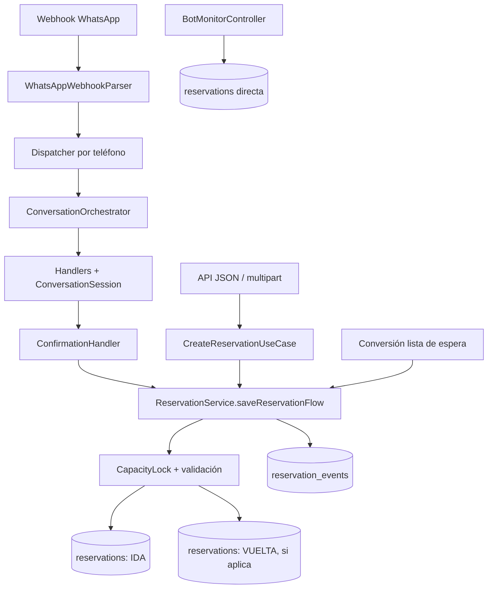

# Flujo integral de reservas (`Reservation`)

## Alcance y resumen ejecutivo

Este documento reconstruye el flujo vigente de creación, actualización y auditoría de reservas en el modelo principal `com.lunaris.ansenuza.domain.model.Reservation`. También identifica el API v2 en migración, que usa otro modelo (`com.lunaris.ansenuza.reservation.domain.model.Reservation`) y otra capa de persistencia.

La creación canónica de web/API y WhatsApp converge en `ReservationService.saveReservationFlow`. Una ida genera una fila; una ida y vuelta genera dos filas relacionadas por `booking_group_code`, con códigos `<ORIGEN>-<DESTINO>-NNN-IDA` y `...-VUELTA`. La sesión conversacional es un agregado temporal separado: conserva elecciones hasta confirmar y luego se elimina.

Hallazgos principales:

1. **Alta — vuelta abierta no auditable por el scheduler.** La vuelta abierta creada por `ReservationService` tiene `travel_date = NULL`, `return_date = NULL` y `travel_status = OPEN_RETURN`, pero `findReturnScheduleAuditCandidates` exige que `travelDate` o `returnDate` esté entre hoy y mañana. Nunca la selecciona.
2. **Alta — turno sin fecha puede cerrar incorrectamente una vuelta abierta.** `ReturnWindowSelectionHandler` escribe `departure_schedule` y cambia `travel_status` a `CONFIRMED`, pero no exige ni asigna `travel_date`. El resultado puede ser `CONFIRMED` con fecha nula.
3. **Alta — creación manual usa otra representación de vuelta abierta.** `BotMonitorController` usa `2099-12-31` en ambas fechas, no fija `travel_status = OPEN_RETURN` y el callback infiere `trip_type = ROUND_TRIP`. Esa fila no cumple el estado canónico y tampoco entra en la auditoría de hoy/mañana.
4. **Media — la UI del bot anuncia vuelta abierta pero no envía ese botón.** `AskReturnDateTypeHandler` acepta `return_open`, pero `AskDateHandler` sólo publica `return_same_day` y `return_choose_date`.
5. **Media — payloads malformados se absorben sin trazabilidad funcional.** El parser indexa/castea `entry/changes/value` sin validar estructura; el controller responde HTTP 200 ante cualquier excepción. Una respuesta interactiva sin ID produce cuerpo nulo y no se registra en `chat_messages`.

## 1. Mapa de entradas y creación

| Canal | Entrada | Cadena de aplicación | Persistencia |
|---|---|---|---|
| API JSON histórica | `POST /api/reservations`, `/api/public/reservations`, `/api/v1/reservations` en `PublicApiController` | `CreateReservationUseCase.execute` → pricing/capacidad/promoción → `ReservationService.saveReservationFlow` | `reservations` + `reservation_events` |
| API multipart | `POST /api/reservations`, `/api/public/reservations` en `ReservationApiController` | Sube comprobante → mismo `CreateReservationUseCase` | Igual, con `payment_receipt_url` |
| WhatsApp Cloud API | `POST /whatsapp/webhook` | `WhatsAppWebhookParser` → `WhatsAppMessageDispatcher` → `ConversationOrchestrator` → handler según `current_step` → `ConfirmationHandler` → `ReservationService.saveReservationFlow` | Durante el diálogo: `conversation_sessions` y `chat_messages`; al confirmar: `passengers`, `reservations`, `reservation_events`; luego elimina la sesión |
| Monitor del operador | `POST /admin/bot/monitor/cargar-reserva` y `/admin/bot/monitor/cargar-reserva-web` | Construcción directa de filas ida/vuelta | `reservationRepository.saveAndFlush`; no pasa por `ReservationService` ni genera `reservation_events` |
| Conversión de lista de espera | `WaitingListConversionService` / reenganche conversacional | Construye reserva y converge en `saveReservationFlow` | Reserva(s) y evento(s) |
| API v2 en migración | `POST /api/v2/reservations` | Puerto `reservation.application.port.in.CreateReservationUseCase` → `ReservationApplicationService` | Tabla `reservations` mediante el adapter v2; modelo paralelo, sin flujo ida/vuelta del servicio principal |
| MVC histórico | `ReservationViewController.POST /reservations/new` | Código comentado; actualmente no es entrada activa | — |



### Normalización y creación en `ReservationService`

Dentro de una transacción:

1. Adquiere el lock lógico de capacidad por `fecha|turno|dirección` mediante `CapacityLockRepository.findForUpdate` (`PESSIMISTIC_WRITE`) y vuelve a contar asientos.
2. Normaliza pasajero, facturación, localidades y prefijo del código.
3. Calcula una secuencia de ruta y evita colisiones consultando los tres formatos de código.
4. Bloquea al pasajero antes de aplicar saldo a favor.
5. Divide importe y descuento entre tramos cuando `roundTrip = true`.
6. Persiste ida y su `RESERVATION_CREATED`.
7. Si corresponde, construye una segunda reserva invertida y persiste vuelta y evento.

La generación de código usa consultas de conteo/`exists`, no un lock de secuencia. El lock de capacidad serializa reservas del mismo día/turno/dirección, lo cual reduce colisiones allí, pero no constituye por sí solo una secuencia global. La restricción única de `reservation_code` es la defensa final.

## 2. Modos de viaje y estados persistidos

| Modalidad | Entrada normalizada | Filas | Estado esperado de vuelta |
|---|---|---:|---|
| Solo ida | `tripType=ONE_WAY`, `roundTrip=false` | 1 | No aplica |
| Ida y vuelta con fecha | `tripType=ROUND_TRIP`, `roundTrip=true`, `returnDate!=null` | 2 | Vuelta con `travel_date=returnDate`; `travel_status` queda por defecto `PENDING`; conserva `trip_type=ROUND_TRIP` |
| Vuelta abierta | `tripType=OPEN_RETURN`, `roundTrip=true`, `returnDate=null` | 2 | Vuelta con `travel_date=NULL`, `travel_status=OPEN_RETURN`, `trip_type=OPEN_RETURN` |

`Reservation.@PrePersist/@PreUpdate` infiere `tripType` sólo si es nulo: `roundTrip=false → ONE_WAY`; `roundTrip=true` y fecha de vuelta nula → `OPEN_RETURN`; con fecha → `ROUND_TRIP`. También asigna UUID defensivo, `travelStatus=PENDING` si falta y dirección de ruta.

Hay dos dimensiones de estado distintas:

- `status`: estado comercial/pago (`PENDING_PAYMENT`, `PAYMENT_RECEIVED`, `CONFIRMED`, `CANCELLED`, etc.).
- `travel_status`: estado operativo del tramo (`PENDING`, `OPEN_RETURN`, `CONFIRMED`, `IN_PROGRESS`, `COMPLETED`, etc.).

No deben usarse como sinónimos. Una reserva puede tener pago `status=CONFIRMED` y aún estar operativamente `OPEN_RETURN`.

## 3. Máquina conversacional y selección de turnos

Secuencia principal simplificada:

```mermaid
stateDiagram-v2
    [*] --> START
    START --> ASK_LOCALITY
    ASK_LOCALITY --> ASK_DESTINATION
    ASK_DESTINATION --> ASK_TRIP_TYPE
    ASK_TRIP_TYPE --> ASK_DATE: trip_ida / trip_completo
    ASK_DATE --> ASK_RETURN_DATE_TYPE: roundTrip=true
    ASK_DATE --> ASK_DNI_REQUIRED: roundTrip=false
    ASK_RETURN_DATE_TYPE --> ASK_RETURN_DATE: return_choose_date
    ASK_RETURN_DATE_TYPE --> ASK_DNI_REQUIRED: return_same_day / return_open
    ASK_RETURN_DATE --> ASK_DNI_REQUIRED
    ASK_DNI_REQUIRED --> ASK_CONFIRMATION: pasos intermedios
    ASK_CONFIRMATION --> [*]: confirm_ok; reserva creada y sesión eliminada
```



La selección del bloque de ida ocurre en `SelectScheduleHandler`:

- `schedule_03_00` o `time_0300` → `conversation_sessions.schedule_block = '03:00 AM'`.
- `schedule_08_00` o `time_0800` → `conversation_sessions.schedule_block = '08:00 AM'`.
- Un valor desconocido no cambia estado ni emite explicación.

`ConfirmationHandler` copia `scheduleBlock` a `Reservation.departureSchedule` (fallback `03:00 AM`) antes de llamar al servicio. La vuelta creada por `ReservationService`, sin embargo, no copia ese horario: queda sin `departure_schedule` hasta una coordinación posterior. Esto es razonable si el bloque de ida no representa el de vuelta.

El parser no interpreta horarios: para `interactive.button_reply` y `interactive.list_reply` extrae únicamente `id`; para mensajes `button` de plantilla usa `payload` y, si falta, `text`. El orquestador busca la sesión por teléfono y deriva al handler de `current_step`.

## 4. Auditoría automática de horario de regreso

`ReturnScheduleAuditScheduler.auditReturnSchedules` corre todos los días a las **09:00 America/Argentina/Cordoba**.

```mermaid
sequenceDiagram
    participant C as Scheduler
    participant R as ReservationRepository
    participant S as conversation_sessions
    participant W as WhatsApp
    participant U as Usuario
    participant H as ReturnWindowSelectionHandler
    C->>R: candidatos(hoy, mañana)
    C->>C: uno por teléfono; prioriza OPEN_RETURN / -VUELTA
    C->>S: carga o crea sesión
    C->>R: claimReturnAudit(id, ahora, inicioDelDía)
    C->>S: current_step=RETURN_WINDOW_SELECTION; reservation_code=...-VUELTA
    C->>W: botones id=1 / id=2
    W-->>U: Tarde / Vespertino
    U->>H: webhook interactive con id
    H->>R: SELECT ... PESSIMISTIC_WRITE por reservation_code
    H->>R: departure_schedule=14:00 o 17:30
    H->>S: current_step=START
```

Para una reserva como `SUA-COR-001-VUELTA`, el scheduler pretende vincular el código a la sesión y enviar:

- `id=1` → `14:00` (Turno Tarde).
- `id=2` → `17:30` (Turno Vespertino).

Antes de enviar, `claimReturnAudit` hace un `UPDATE` condicional atómico sobre `return_audit_sent_at`; evita duplicados entre instancias. El costo es que una falla de WhatsApp posterior al claim deja la reserva marcada y no reintenta ese día.

La consulta actual sólo trae reservas `roundTrip=true` u `OPEN_RETURN` cuya `travelDate` **o** `returnDate` esté en hoy/mañana. Por eso funciona principalmente para vueltas ya fechadas; una vuelta abierta canónica con ambas fechas nulas queda fuera.

## 5. Transaccionalidad, locks y tablas de auditoría

### `reservations`

- `saveReservationFlow`, confirmación conversacional y `ReturnWindowSelectionHandler` son transaccionales.
- La selección de retorno usa `findByReservationCodeForUpdate`, un `PESSIMISTIC_WRITE`. En PostgreSQL/Hibernate equivale a un bloqueo de fila para actualización (habitualmente `FOR NO KEY UPDATE` para cambios que no modifican claves); el SQL exacto depende del dialecto/versión de Hibernate.
- Confirmación de pago bloquea la fila o el grupo completo con `findByIdForUpdate` / `findReservationGroupForUpdate`.
- El endpoint MVC `/reservations/update/{id}` tiene transacción y hace `saveAndFlush`, pero lee inicialmente con `findById`, sin lock pesimista; dos actualizaciones administrativas concurrentes pueden pisarse porque la entidad no tiene `@Version`.

### `reservation_events`

`ReservationService` inserta un evento por tramo dentro de la misma transacción que las reservas. Las altas directas de `BotMonitorController` no generan estos eventos, creando una brecha de auditoría por canal.

### `conversation_sessions`

- Guarda el estado temporal del bot por `phone_number` único: paso, fechas, ida/vuelta, turno y código de reserva auditada.
- Cada mensaje procesable actualiza `last_interaction` y hace `saveAndFlush` antes del handler.
- Al confirmar una reserva normal, `ConfirmationHandler` elimina la sesión; el historial de chat no se elimina.
- El scheduler reutiliza una sesión en `RETURN_WINDOW_SELECTION`, pero omite sesiones activas en otro paso (salvo bot pausado; ver hallazgo R4).

### `chat_messages`

`ConversationOrchestrator` llama `LiveChatPort.recordIncomingMessage`; `WebSocketLiveChatAdapter` inserta el texto/payload entrante con `is_from_operator=false` y luego publica WebSocket. Los mensajes interactivos válidos quedan auditados como su ID (`1`, `2`, etc.), no como el título visible ni con referencia estructurada a la reserva. El envío saliente del scheduler no se registra aquí desde esta clase.

La persistencia de `chat_messages`, el `saveAndFlush` de sesión y la mutación de reserva no forman una única transacción extremo a extremo: el dispatcher es asíncrono y cada componente define su frontera. Esto permite diagnóstico parcial, pero no atomicidad entre recepción, chat, sesión, reserva y llamada externa.

## 6. Code review: inconsistencias y riesgos

### R1 — Alta: las vueltas abiertas no son candidatas del scheduler

**Evidencia:** `ReservationService` crea la vuelta abierta con ambas fechas nulas. `ReservationRepository.findReturnScheduleAuditCandidates` exige un rango sobre alguna fecha.

**Impacto:** nunca se envían automáticamente los botones para una vuelta abierta genuina. La marca `return_audit_sent_at` tampoco se actualiza.

**Corrección mínima propuesta:** separar casos de negocio. El scheduler de “preferencia de horario del regreso de hoy/mañana” debe consultar sólo vueltas con fecha efectiva. La coordinación de una vuelta abierta necesita primero fecha (otro paso/prompt). Si el requerimiento es auditar abiertas, agregar una política temporal explícita (por ejemplo, basada en solicitud del pasajero o antigüedad), no incluir indiscriminadamente todas las filas `OPEN_RETURN` cada día.

### R2 — Alta: `OPEN_RETURN` pasa a `CONFIRMED` sin fecha

**Evidencia:** `ReturnWindowSelectionHandler` siempre fija `travelStatus=CONFIRMED` después de seleccionar 1/2 y no valida `travelDate`.

**Impacto:** inconsistencia `travel_status=CONFIRMED`, `travel_date=NULL`; la sesión vuelve a `START` y parece finalizada aunque el tramo no es ejecutable.

**Corrección mínima propuesta:** si `travelStatus == OPEN_RETURN` o `travelDate == null`, no cerrar el estado: conservar `OPEN_RETURN` y solicitar fecha en un paso específico. Sólo una vuelta ya fechada debe aceptar el turno y pasar a `PENDING`/`CONFIRMED` según la convención operativa acordada. Añadir una precondición de dominio antes del `saveAndFlush`.

### R3 — Alta: canal manual produce vueltas abiertas incompatibles

**Evidencia:** los dos métodos de alta en `BotMonitorController` construyen ida/vuelta y persisten directamente. Sin fecha usan el centinela `2099-12-31`, pero no asignan `travelStatus=OPEN_RETURN`; `@PrePersist` ve `returnDate!=null` e infiere `ROUND_TRIP`.

**Impacto:** consultas basadas en estado y consultas basadas en centinela devuelven conjuntos diferentes; el scheduler temporal no las selecciona y no hay `reservation_events`.

**Corrección mínima propuesta:** hacer converger el monitor en `ReservationService.saveReservationFlow` con `tripType=OPEN_RETURN` y fechas nulas. Si la migración del centinela debe ser gradual, normalizar explícitamente estado/tipo al crear y retirar el centinela en una migración posterior.

### R4 — Media: sesión pausada puede ser sobrescrita por auditoría

**Evidencia:** el scheduler sólo omite una sesión en otro paso cuando `!session.isBotPaused()`. Si está pausada por atención humana, puede reemplazar `current_step` y `reservation_code`.

**Impacto:** al reanudar, se pierde el punto del flujo anterior y una respuesta humana podría interpretarse como selección 1/2.

**Corrección mínima propuesta:** omitir toda sesión con `botPaused=true`; no mutar sesiones bajo control del operador.

### R5 — Media: opción de vuelta abierta no está expuesta

**Evidencia:** `AskReturnDateTypeHandler` maneja `return_open`, pero `AskDateHandler` no incluye ese botón aunque el texto lo ofrece.

**Impacto:** el usuario no puede seleccionar el caso nominal desde la interacción mostrada, salvo enviar manualmente un payload que no conoce.

**Corrección mínima propuesta:** agregar `new Button("return_open", "Fecha abierta")` (Meta admite hasta tres quick-reply buttons) y cubrirlo con test.

### R6 — Media: parser frágil y webhook silencioso

**Evidencia:** acceso directo al primer `changes` y casts no verificados; un `interactive` desconocido retorna `IncomingMessage` con cuerpo nulo. El controller captura todo, registra log técnico y responde 200.

**Impacto:** se pierden botones malformados/no mapeados sin feedback al pasajero ni fila en `chat_messages`. HTTP 200 evita reintentos de Meta incluso ante errores internos.

**Corrección mínima propuesta:** navegación defensiva del payload; distinguir eventos no procesables de payload inválido; registrar tipo/ID de mensaje de Meta y motivo. Para ID desconocido con sesión válida, mantener el paso y enviar opciones válidas. Mantener 200 para eventos que Meta no debe reintentar, pero medirlos con log/contador estructurado.

### R7 — Media: sesión nula/recreada puede descontextualizar un botón tardío

**Evidencia:** el orquestador crea una sesión `START` si no existe. Un botón 1/2 tardío sin sesión de auditoría se entrega a `START`, no a retorno. En cambio, una sesión del scheduler siempre tiene código, pero no existe FK entre sesión y reserva.

**Impacto:** la interacción queda registrada pero no actualiza la reserva y puede iniciar el menú.

**Corrección mínima propuesta:** usar IDs de botón autocontenidos y no ambiguos, por ejemplo `RETURN_WINDOW:<reservationId>:1`, validar que la reserva pertenece al teléfono y usar `reservationCode` de sesión sólo como compatibilidad temporal.

### R8 — Media: no hay atomicidad scheduler/sesión/envío

**Evidencia:** `claimReturnAudit` confirma su propia actualización antes de `saveAndFlush(session)` y antes de WhatsApp; el scheduler no engloba el ciclo en una transacción, y una llamada externa no sería atómica de todos modos.

**Impacto:** una excepción al guardar sesión o enviar deja `return_audit_sent_at` reclamado sin prompt entregado. Invertir el orden generaría duplicados en caso de caída.

**Corrección mínima propuesta:** outbox de notificaciones con clave idempotente `(reservation_id, audit_date, type)`; como parche mínimo, revertir/limpiar la marca si falla el envío y no hay certeza de entrega, aceptando el riesgo documentado de duplicado.

### R9 — Media: transición operativa discutible para vueltas fechadas

**Evidencia:** una vuelta creada con fecha nace `travelStatus=PENDING`; al elegir preferencia pasa a `CONFIRMED`, mientras `status` ya representa confirmación comercial. Otras actualizaciones de vuelta abierta en `ReservationViewController` fijan `travelStatus=PENDING` al programarla.

**Impacto:** dos canales dejan estados operativos distintos ante una acción equivalente.

**Corrección mínima propuesta:** declarar una tabla de transición única. La opción más conservadora con el código existente es que seleccionar/programar fecha y turno deje `travelStatus=PENDING`; reservar `CONFIRMED` para una confirmación logística explícita. Aplicarlo en handler y controller.

### R10 — Baja: cobertura actual valida el comportamiento inconsistente

`ReturnWindowSelectionHandlerTest` construye una reserva `OPEN_RETURN` sin fecha y espera que termine `CONFIRMED`; el test protege el defecto R2. `ReturnScheduleAuditSchedulerTest` usa mocks y no valida la consulta JPQL ni una vuelta con fechas nulas. El parser tiene casos felices, sin payloads vacíos, `changes=[]`, reply sin ID o tipo interactivo desconocido.

## 7. Plan mínimo de corrección recomendado

Orden sugerido, manteniendo cambios acotados:

1. Agregar el botón `return_open` y sus tests.
2. Fortalecer `ReturnWindowSelectionHandler`: validar sesión/código/pertenencia, exigir fecha para cerrar el estado y unificar transición a `PENDING`.
3. Evitar que el scheduler toque sesiones pausadas; agregar pruebas de sesión activa, pausada, claim fallido y fallo de envío.
4. Corregir la consulta/semántica: el scheduler de turno sólo debe tomar vueltas fechadas; crear un flujo separado de asignación de fecha para `OPEN_RETURN`.
5. Migrar las altas manuales al servicio canónico y eliminar gradualmente `2099-12-31`.
6. Hacer defensivo el parser y añadir observabilidad de payloads descartados.
7. Como mejora estructural posterior, usar outbox para WhatsApp y payloads con UUID de reserva.

### Casos de prueba que faltan

- Ida, round trip fechado y open return verificando las dos filas completas.
- Vuelta abierta: no puede pasar a estado programado sin fecha.
- Selección 1/2 con vuelta fechada: persiste horario y transición canónica.
- Payload interactivo desconocido, reply sin ID, `entry/changes/messages` vacíos.
- Sesión inexistente, sesión en otro paso y sesión pausada durante auditoría.
- Dos ejecuciones concurrentes del scheduler: un solo claim/envío.
- Falla de WhatsApp después del claim.
- Test de repositorio real para `findReturnScheduleAuditCandidates` con PostgreSQL/Testcontainers o perfil equivalente.
- Alta manual y alta API producen el mismo estado/tipo para vuelta abierta.

## 8. Validación

Se ejecutó la suite completa con:

```bash
./mvnw test
```

Resultado: **BUILD SUCCESS — 292 tests ejecutados, 0 fallos, 0 errores, 0 omitidos** (12/08/2026). Los tests existentes cubren principalmente caminos felices y, en el caso de la vuelta abierta sin fecha, actualmente afirman la transición inconsistente descrita en R2.
