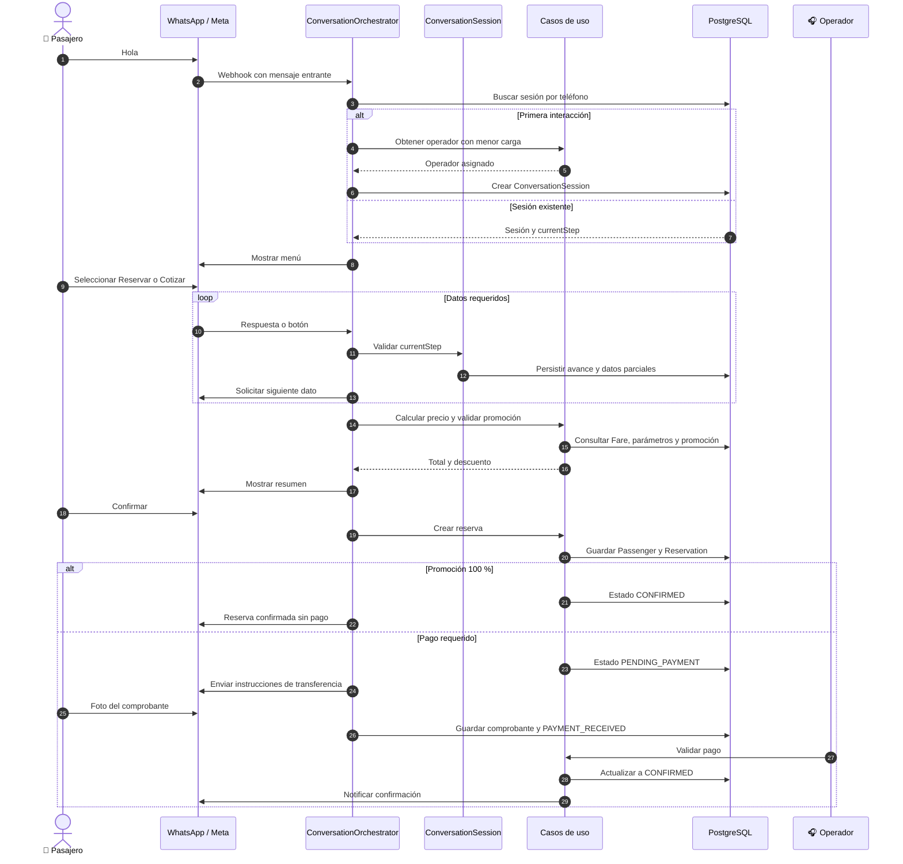
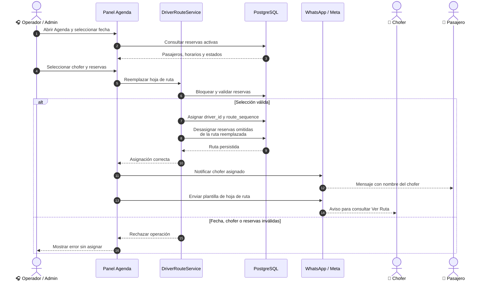
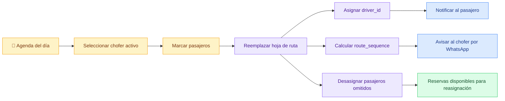
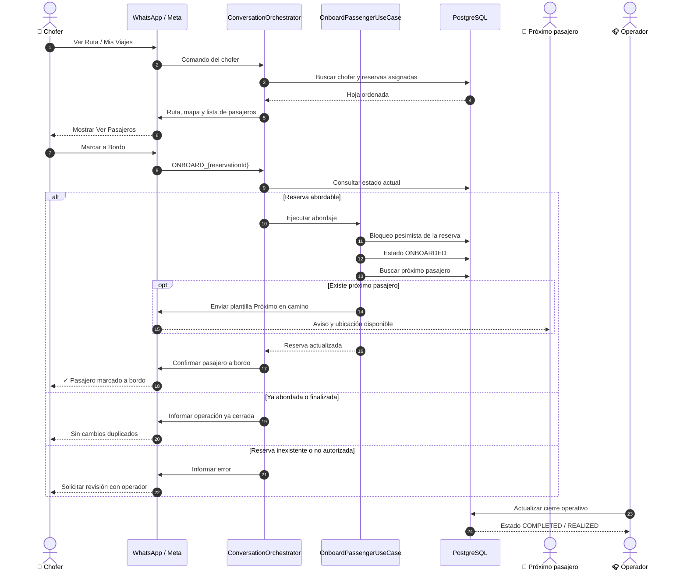
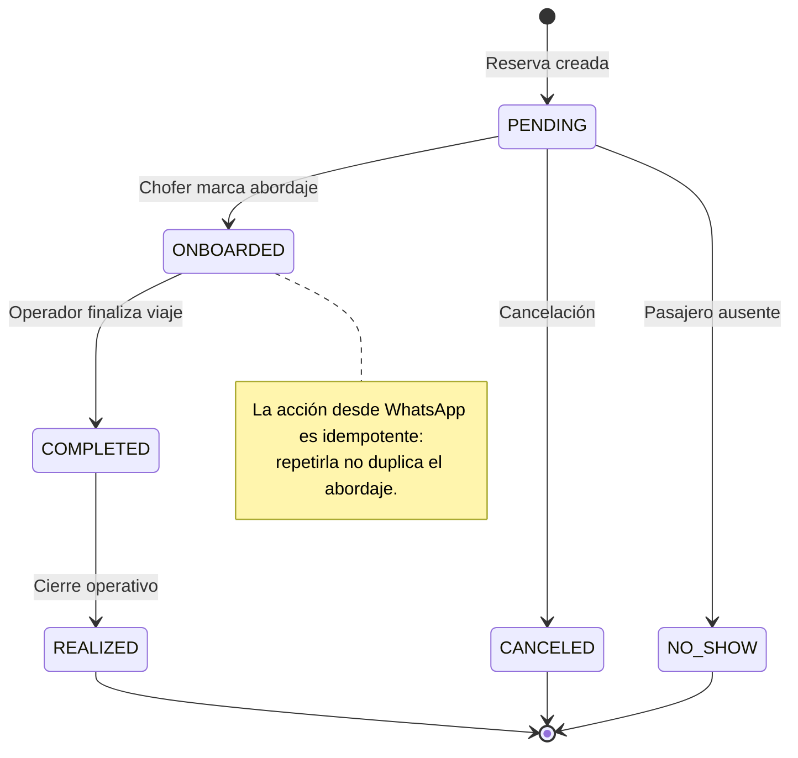
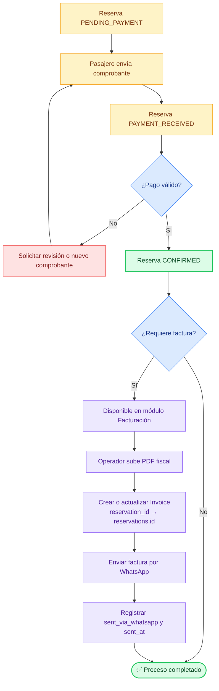
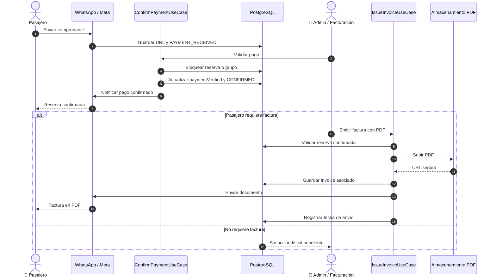

# Diagramas de Procesos y Roles — Lunaris Ansenuza

Este documento presenta los principales actores y flujos operativos de la
plataforma. Los diagramas utilizan sintaxis Mermaid compatible con renderizadores
Markdown modernos.

## 1. 👥 Diagrama de roles y casos de uso

> Mermaid no dispone de un tipo `usecase` estándar. Este modelo utiliza
> `flowchart LR` con actores y casos de uso agrupados por dominio.

```mermaid
flowchart LR
    passenger["👤 Pasajero"]
    driver["🚐 Chofer"]
    operator["🎧 Operador"]
    admin["🛡️ Administrador"]
    billing["🧾 Facturación"]

    subgraph passengerCases["Canales del pasajero — Web y WhatsApp"]
        quote(["Cotizar traslado"])
        reserve(["Crear reserva"])
        consult(["Consultar viajes"])
        cancel(["Cancelar reserva"])
        pay(["Enviar comprobante de pago"])
        promo(["Aplicar código promocional"])
    end

    subgraph driverCases["Atención del chofer — WhatsApp"]
        route(["Consultar Hoja de Ruta<br/>Ver Ruta / Mis Viajes"])
        location(["Notificar ubicación"])
        onboard(["Marcar abordaje<br/>Marcar a Bordo"])
    end

    subgraph operationCases["Panel operativo"]
        reservations(["Gestionar reservas"])
        agenda(["Gestionar agenda"])
        assign(["Asignar choferes"])
        unassign(["Desasignar o reemplazar rutas"])
        passengers(["Gestionar pasajeros"])
        chats(["Atender chats"])
    end

    subgraph adminCases["Administración"]
        drivers(["Gestionar choferes"])
        fares(["Administrar tarifas"])
        localities(["Administrar localidades"])
        users(["Gestionar usuarios y roles"])
        configuration(["Configurar bot y operación"])
    end

    subgraph billingCases["Gestión fiscal"]
        validate(["Validar pago"])
        invoice(["Emitir factura"])
        resend(["Enviar o reenviar PDF"])
    end

    passenger --> quote
    passenger --> reserve
    passenger --> consult
    passenger --> cancel
    passenger --> pay
    passenger --> promo

    driver --> route
    driver --> location
    driver --> onboard

    operator --> reservations
    operator --> agenda
    operator --> assign
    operator --> unassign
    operator --> passengers
    operator --> chats

    admin --> reservations
    admin --> agenda
    admin --> assign
    admin --> unassign
    admin --> passengers
    admin --> chats
    admin --> drivers
    admin --> fares
    admin --> localities
    admin --> users
    admin --> configuration
    admin --> validate
    admin --> invoice
    admin --> resend

    billing --> validate
    billing --> invoice
    billing --> resend

    classDef actor fill:#1e293b,color:#ffffff,stroke:#0f172a,stroke-width:2px;
    classDef passengerUse fill:#dbeafe,color:#1e3a8a,stroke:#3b82f6;
    classDef driverUse fill:#dcfce7,color:#14532d,stroke:#22c55e;
    classDef operationUse fill:#fef3c7,color:#78350f,stroke:#f59e0b;
    classDef adminUse fill:#ede9fe,color:#4c1d95,stroke:#8b5cf6;
    classDef billingUse fill:#fee2e2,color:#7f1d1d,stroke:#ef4444;

    class passenger,driver,operator,admin,billing actor;
    class quote,reserve,consult,cancel,pay,promo passengerUse;
    class route,location,onboard driverUse;
    class reservations,agenda,assign,unassign,passengers,chats operationUse;
    class drivers,fares,localities,users,configuration adminUse;
    class validate,invoice,resend billingUse;
```



### Matriz resumida de permisos

| Rol | Capacidades principales |
| --- | --- |
| `PASSENGER` | Perfil y reservas propias mediante web o WhatsApp |
| `CHOFER` | Hoja de ruta, ubicación y abordaje |
| `OPERADOR` | Reservas, agenda, pasajeros, asignaciones y chats |
| `ADMIN` | Acceso operativo y configuración integral |
| `FACTURACION` | Facturas y documentación fiscal |

---

## 2. 🤖 Flujo completo del bot y la reserva

```mermaid
flowchart TD
    start([👤 Pasajero escribe Hola o Menú])
    session{¿Existe sesión?}
    createSession["Crear ConversationSession<br/>Asignar operador con menor carga"]
    menu["Mostrar menú principal"]
    choice{Opción elegida}

    quote["2 — Ver precios y cotizar"]
    booking["1 — Reservar viaje"]
    support["3 — Hablar con operador"]
    trips["4 — Consultar reservas"]
    cancellation["5 — Cancelar viaje"]

    locality["Seleccionar localidad de origen"]
    schedule["Seleccionar horario disponible"]
    knownPassenger{¿Pasajero registrado?}
    identity["Solicitar nombre y datos"]
    companions["Indicar acompañantes"]
    knownAddress{¿Domicilio habitual<br/>en la localidad?}
    confirmAddress["Confirmar domicilio existente"]
    newAddress["Ingresar o compartir nueva dirección"]
    destination["Seleccionar destino"]
    tripType["Elegir solo ida o ida y vuelta"]
    outboundDate["Ingresar fecha de ida"]
    returnChoice{¿Ida y vuelta?}
    returnDate["Elegir fecha de vuelta<br/>o vuelta abierta"]
    invoiceData["Indicar necesidad de factura<br/>y datos fiscales"]
    promotion["Ingresar código de 4 dígitos<br/>o SIN PROMO"]
    summary["Mostrar resumen y precio"]
    confirm{¿Confirmar reserva?}
    persist["Guardar Passenger y Reservation"]
    freePromo{¿Promoción del 100 %?}
    paymentPending["Estado PENDING_PAYMENT<br/>Enviar datos bancarios"]
    sendReceipt["Pasajero envía comprobante"]
    receiptReceived["Estado PAYMENT_RECEIVED"]
    validatePayment["Operador valida el pago"]
    confirmed["Estado CONFIRMED"]
    end([✅ Reserva confirmada])

    start --> session
    session -- No --> createSession --> menu
    session -- Sí --> menu
    menu --> choice

    choice -- "1" --> booking --> locality
    choice -- "2" --> quote --> locality
    choice -- "3" --> support
    choice -- "4" --> trips
    choice -- "5" --> cancellation

    locality --> schedule --> knownPassenger
    knownPassenger -- No --> identity --> companions
    knownPassenger -- Sí --> companions
    companions --> knownAddress
    knownAddress -- Sí --> confirmAddress --> destination
    knownAddress -- No --> newAddress --> destination
    destination --> tripType --> outboundDate --> returnChoice
    returnChoice -- Sí --> returnDate --> invoiceData
    returnChoice -- No --> invoiceData
    invoiceData --> promotion --> summary --> confirm
    confirm -- No --> menu
    confirm -- Sí --> persist --> freePromo
    freePromo -- Sí --> confirmed
    freePromo -- No --> paymentPending --> sendReceipt
    sendReceipt --> receiptReceived --> validatePayment --> confirmed --> end

    classDef startEnd fill:#1e293b,color:#ffffff,stroke:#0f172a,stroke-width:2px;
    classDef interaction fill:#dbeafe,color:#1e3a8a,stroke:#3b82f6;
    classDef decision fill:#fef3c7,color:#78350f,stroke:#f59e0b;
    classDef persistence fill:#ede9fe,color:#4c1d95,stroke:#8b5cf6;
    classDef success fill:#dcfce7,color:#14532d,stroke:#22c55e,stroke-width:2px;
    classDef exception fill:#fee2e2,color:#7f1d1d,stroke:#ef4444;

    class start,end startEnd;
    class menu,quote,booking,support,trips,cancellation,locality,schedule,identity,companions,confirmAddress,newAddress,destination,tripType,outboundDate,returnDate,invoiceData,promotion,summary,sendReceipt interaction;
    class session,choice,knownPassenger,knownAddress,returnChoice,confirm,freePromo decision;
    class createSession,persist,paymentPending,receiptReceived,validatePayment persistence;
    class confirmed success;
```

### Secuencia WhatsApp–backend



---

## 3. 📅 Asignación de reservas a un chofer





---

## 4. 🚐 Abordaje y ciclo del viaje



### Máquina de estados operativa simplificada



> En el modelo persistido, `ONBOARD`, `BOARDED` y `ONBOARDED` son estados
> reconocidos por compatibilidad. El flujo conversacional actual escribe
> `ONBOARDED`. El cierre puede representarse mediante el estado comercial
> `COMPLETED` y el estado operativo `REALIZED`.

---

## 5. 🧾 Pago, confirmación y facturación





---

## 6. 🎨 Leyenda visual

- 🔵 **Azul:** interacción con usuarios o canales.
- 🟡 **Amarillo:** decisión o actividad operativa.
- 🟣 **Violeta:** persistencia y procesos internos.
- 🟢 **Verde:** resultado exitoso o estado confirmado.
- 🔴 **Rojo:** rechazo, cancelación o error.
- ⚫ **Oscuro:** actor o punto de inicio/fin.

